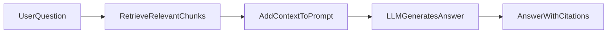
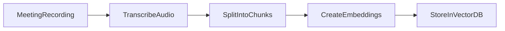
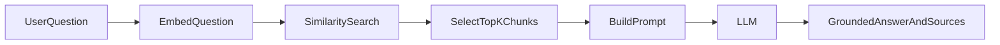

# RAG for Meeting Intelligence
## Team Training Deck

**Purpose:** Explain RAG clearly so the team can design, build, and validate the meeting-agent feature.

---

## Slide 1: What is RAG?

**RAG (Retrieval-Augmented Generation)** is a pattern where an AI model first fetches relevant information, then answers using that information.

- Retrieve trusted context from your data
- Add it to the prompt
- Generate a grounded response

**One-liner:**  
RAG = Find the right context, then answer.

---

## Slide 2: Why RAG Matters for Meetings

Without RAG:
- Higher hallucination risk
- No evidence trail
- Weak trust in answers

With RAG:
- Answers grounded in meeting transcripts
- Better factual accuracy
- Citation-ready responses with timestamps

---

## Slide 3: RAG in One Visual

Speaker note: The model still generates text, but now it generates from retrieved evidence.

---

## Slide 4: Data Preparation Pipeline (Offline)

Key point: We prepare searchable knowledge before users ask questions.

---

## Slide 5: Question Answering Pipeline (Online)

Key point: Retrieval determines answer quality.

---

## Slide 6: What Good RAG Looks Like

Good answer:
- Uses transcript evidence
- Includes citations/timestamps
- Says "not enough context" when evidence is missing

Bad answer:
- Confident but unsupported
- No sources
- Includes facts not found in the transcript

Team rule: **No citation = low trust**.

---

## Slide 7: Build and QA Checklist

- Chunking has overlap (preserves context)
- Retrieval always scoped by `meeting_id` (and `tenant_id` if multi-tenant)
- Top-K retrieval tuned
- Prompt enforces "use only provided context"
- Citations returned in every response
- Logs capture retrieved chunk IDs and latencies
- User feedback loop enabled (thumbs up/down)

---

## Slide 8: Demo Script for Team Training

1. Ask: "What decisions were made about the release timeline?"
2. Show retrieved chunks (with timestamps)
3. Show final answer with citations
4. Ask a question outside transcript scope
5. Confirm safe fallback: "I do not have enough evidence from this meeting transcript."

Expected training outcome:
- Team can explain offline vs online RAG flow
- Team understands why citations are required
- Team can identify good vs weak RAG responses

---

## Appendix (Optional)

### A. Common Failure Modes
- Chunks too small: fragmented meaning
- Chunks too large: noisy retrieval
- Missing metadata filters: wrong meeting data leaks in
- No fallback behavior: hallucinations

### B. Tuning Levers
- `chunk_size`
- `chunk_overlap`
- `top_k`
- Prompt constraints
- Embedding model choice

### C. Suggested 25-Minute Session Plan
- 5 min: RAG basics
- 8 min: Two pipeline visuals
- 7 min: Live demo
- 5 min: Q&A + checklist review
